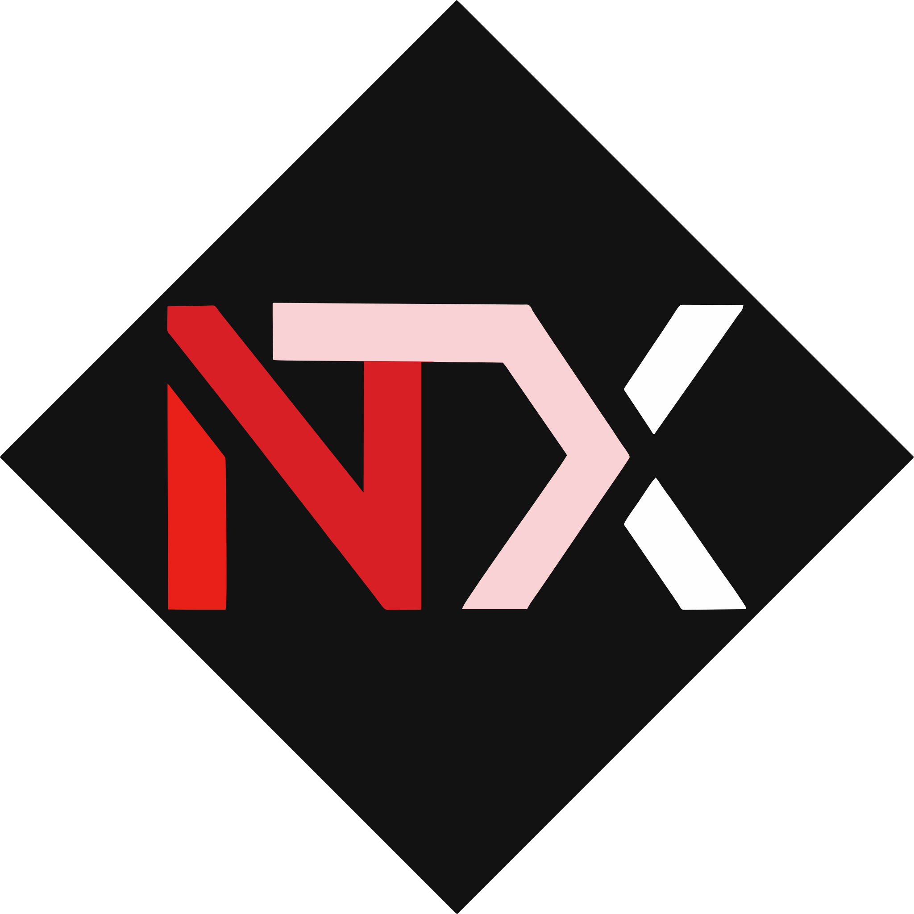
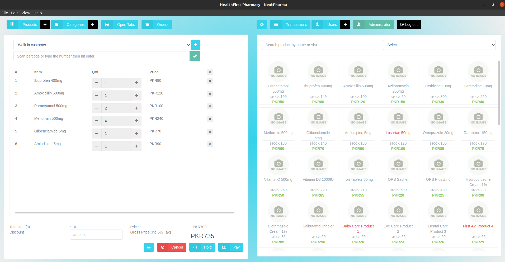
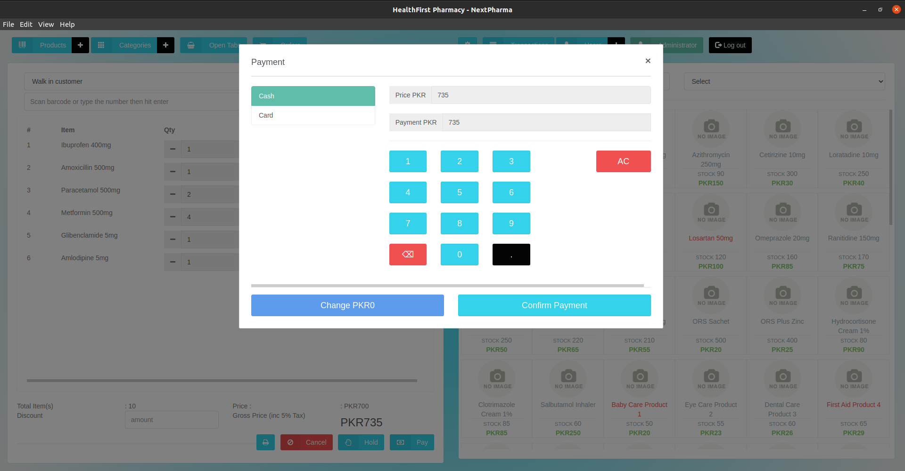
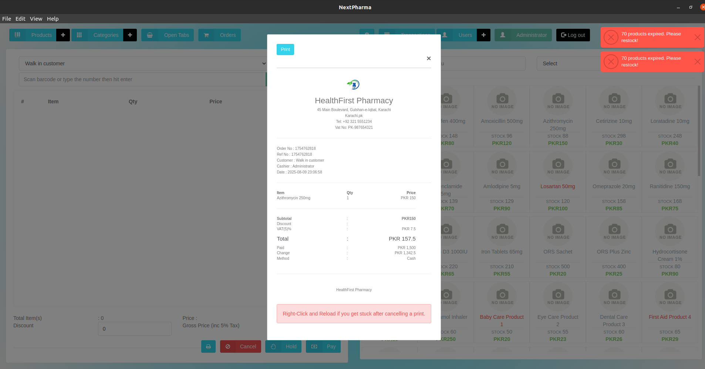
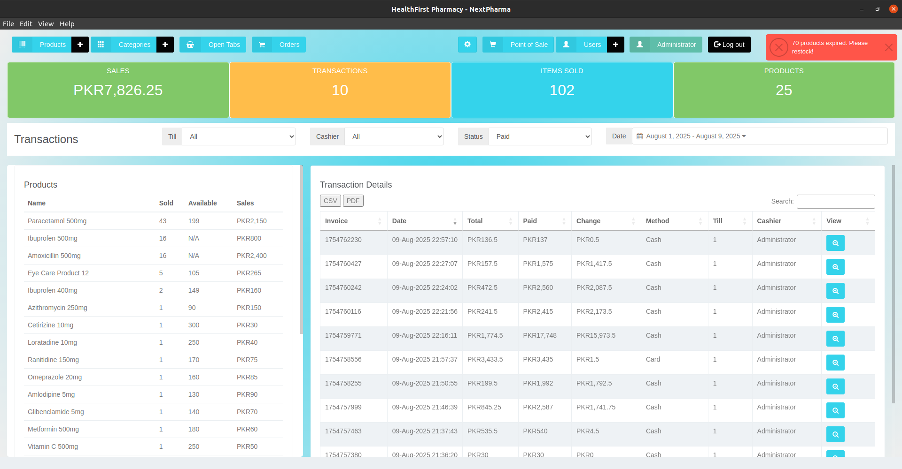
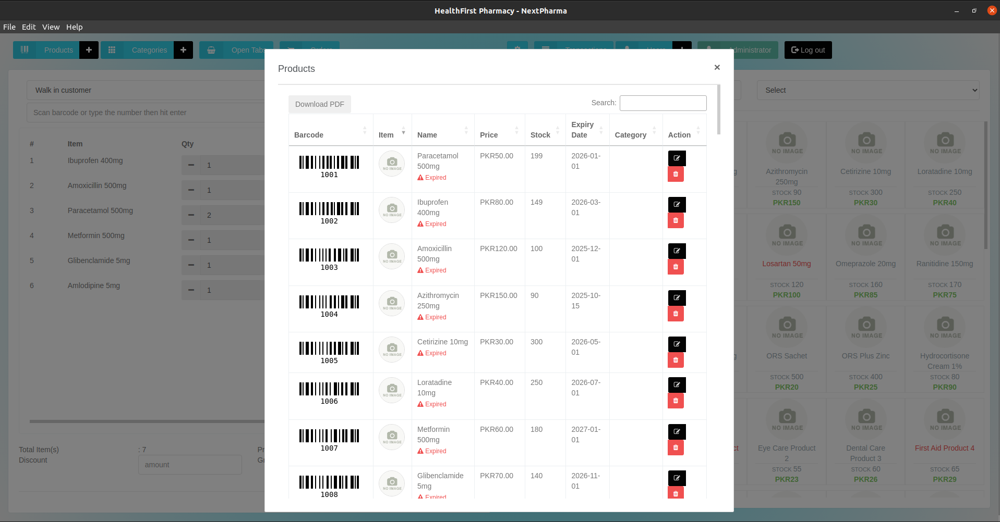

# NextPharma Point of Sale



NextPharma is a cross-platform Point of Sale system designed for pharmacies and built to streamline operations and enhance customer service.

## Features

✔️ **Multi-PC Support:** Allows multiple computers on a network to access a central database, ensuring data consistency across all locations.

✔️ **Receipt Printing:** Generate professional receipts for your customers, making transactions more convenient.

✔️ **Product Search:** Quickly find products by scanning barcodes, simplifying inventory management.

✔️ **Staff Accounts and Permissions:** Create user accounts with various permission levels to control access and actions within the system.

✔️ **Product and Category Management:** Easily manage your products and categorize them for efficient organization.

✔️ **User Management:** Administer and maintain user accounts for your staff members.

✔️ **Basic Stock Management:** Keep track of your inventory and update stock levels as needed.

✔️ **Open Tabs and Orders:** Manage open tabs and orders to accommodate customer preferences.

✔️ **Customer Database:** Maintain a customer database to personalize interactions and build loyalty.

✔️ **Transaction History:** Access a comprehensive record of all transactions for reference and reporting.

✔️ **Transaction Filtering:** Filter transactions by till, cashier, or status, providing valuable insights into your sales.

✔️ **Date Range Filtering:** Narrow down transactions based on specific date ranges for in-depth analysis.

✔️ **Custom Barcode Support:** Define custom barcodes for products, enhancing flexibility in inventory management.

✔️ **Product Expiry Date Tracking:** Keep an eye on product expiry dates to prevent sales of expired items.

✔️ **Profit Calculation:** Calculate profit per item and total profit, helping you make informed business decisions.

✔️ **Low Stock Alerts:** Receive alerts for low stock levels to avoid running out of popular products.

✔️ **Expiry Date Alerts:** Stay informed about product expiration dates, reducing waste and potential liabilities.

✔️ **Improved UI** Enjoy a fresh, modern look with enhanced display quality, making the user experience more appealing.


## Demo

[NextPharma Video Preview] <video width="600" controls>
  <source src="assets/nextpharma.mp4)" type="video/mp4">
  Your browser does not support the video tag.
</video>

| **Point of Sale** |  **Payment Point** |
|--|--|
|  ||
| **Receipt** |  **Transactions** |
| | |
| **Status Alerts** | **More on the Roadmap** |
|| <ul><li>Auto Updates</li><li>Back up</li><li>Restore</li><li>Export to excel</li></ul>


## Getting Started
- Download [NextPharma](https://github.com/irfanzahoor/NextPharma/releases/latest)
- Unzip the package to a location of your choice.
- Click the ``NextPharma`` executable in the folder
- Login for default user:

	- ``username:`` admin
	- ``password:`` admin

## For Developers
- Clone this project.
- Open terminal and navigate into the cloned folder.
- Run ```npm install``` to install dependencies.
- Run ```npm run start```.
- Run ```gulp``` to bundle css and js assets
- Run ```npm run test``` to run tests
